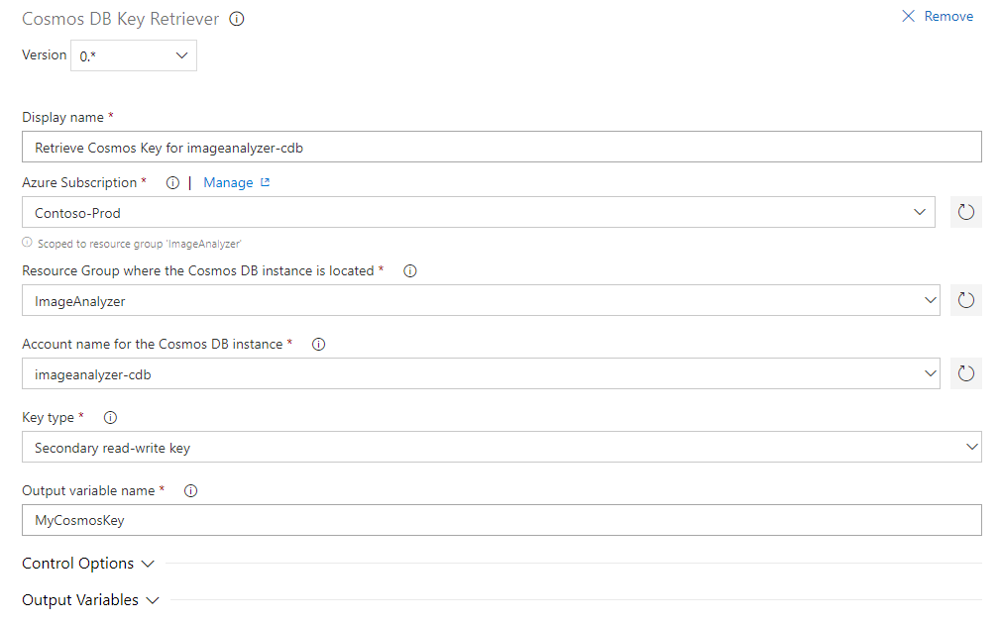

# Retrieve Cosmos DB keys

This extension can retrieve the access keys from a Cosmos DB Account.

You must pass in an Azure Resource Manager Subscription, the Cosmos DB Account 
Name, and the resource group where the account is located.
It will return the key type of your choice in a release pipeline variable with 
a name you define.

You can select which key type you want returned from the Cosmos DB account and 
also set the variable name to get the key.

## Usage

To configure the Cosmos DB Key Retriever task, first select an Azure Resource 
Manager service connection or Azure subscription.

Next, choose the resource group in which the Cosmos DB account is located.

Finally, enter or select the Cosmos DB account to retrieve keys from.

Optionally, select a different key type and change the output variable name.

The variable name that you enter may be a reference to another variable, in
that case enter it as `$(name)`. Then the contents of `name` will be used as 
the output variable name.

## Security

The read-write keys give full access to changing and deleting data in the 
Cosmos DB instance.

If your pipeline only requires read-only access to Cosmos DB, it is highly 
recommended to retrieve the read-only keys.

The extension marks the variable contents as "secret" in Azure DevOps Services.
This means that the key value will not occur in the release logs.

The extension does not store or transfer or otherwise leak your Cosmos DB keys.
The full extension source is available on
[the GitHub project page](https://github.com/rwatjen/CosmosKeyRetrieverVSTSExtension).

## Limitations

The extenion does not work with service connections that use certificate 
authentication.

## Questions

If you need help, please go to the 
[GitHub issues page](https://github.com/rwatjen/CosmosKeyRetrieverVSTSExtension/issues).

If you want to help improve the extension; perhaps it doesn't do quite what 
you need, then feel free to reach out via GitHub as well.